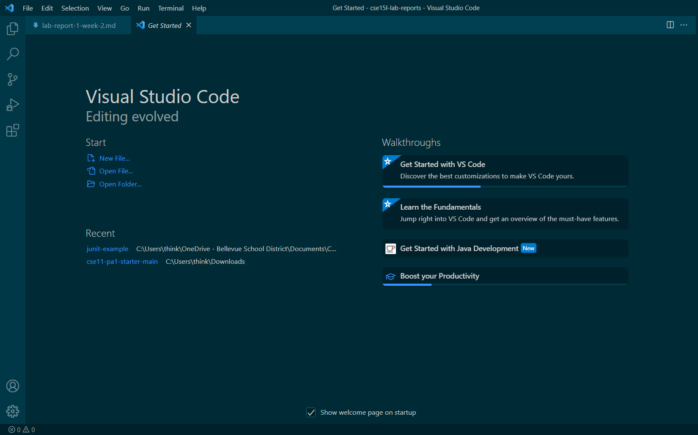
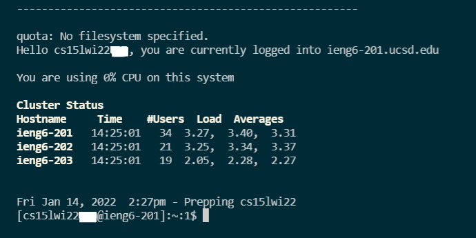
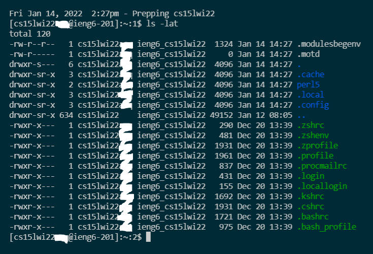
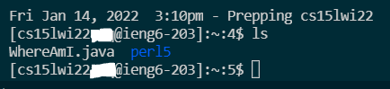
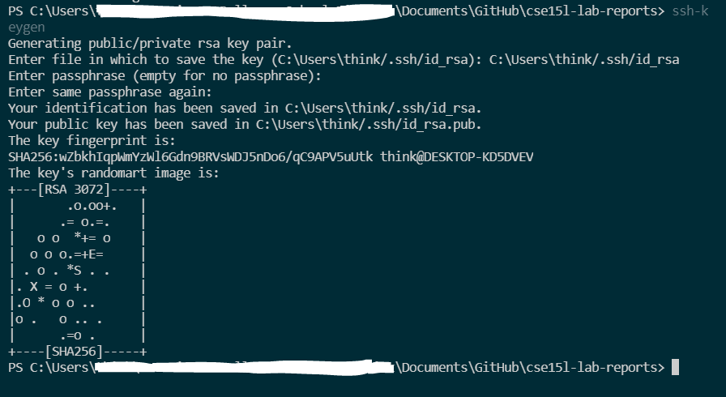
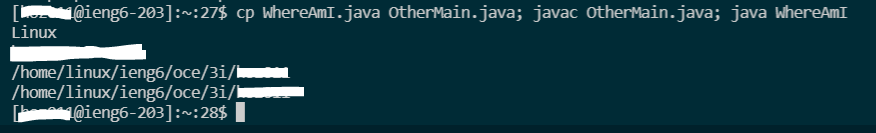

# Lab Report 1- Remote Access
*JANUARY 14, 2022*

**The following is a tutorial on how to log into and access files on a remote `ieng6` account.**

*[Operating System Used: Windows]*

## STEP ONE: INSTALLING VSCODE
---

1. Click on the following link to download VSCode to your computer: [Link](https://code.visualstudio.com/)
2. Once downloaded, open VSCode and you should see a screen that looks something like the following (color/format may be different): 

    

## STEP TWO: REMOTELY CONNECTING
---

1. Make sure you have a program called OpenSSH installed. If you don't or aren't sure, see this link for more detailed instructions: [Link](https://docs.microsoft.com/en-us/windows-server/administration/openssh/openssh_install_firstuse)
2. Look up your CSE15L account here: [Link](https://sdacs.ucsd.edu/~icc/index.php)
3. Open VSCode, create a new terminal, and type the following into the terminal:

    `$ ssh cs15lwi22__@ieng6.ucsd.edu`

    with your own account information.

4. Enter your password and press Enter. The terminal should display something like this:

    

*(If your password doesn't work, you may need to reset it.)*

## STEP THREE: TRYING COMMANDS
---

**Running these commands will execute them on the remote server.**

1. The following are all commands you can try running in the terminal once you have logged in:

    `cd ~`, `cd`, `ls -lat`, `ls -a`, plus others. All do different things.

    For instance, running `ls -lat` will display something similar to the following:

    

    *`ls -lat`  displays a list of files in the directory, as well as the dates and times at which they were modified.*

2. You can also log out of the remote server from you terminal by type Ctrl+D or running the command `exit`.

## STEP FOUR: MOVING FILES WITH SCP
---

**The command `scp`, when run from the client server, can copy file(s) from a client server to a remote server.** 

1. To use `scp`, run the following command in the same directory as the file you want to copy:

    `scp [file name].java cs15lwi22__@ieng6.ucsd.edu:~/`

2. Then, log back in using ssh, and use the `ls` command to see if your file has been copied into the remote server. If it was successful, you should see the file name.

    

3. You can also run the file on the remote server using `javac` and `java`.

## STEP FIVE: SETTING AN SSH KEY
---

**Since it's time-consuming and inefficient to type in our password every time we log in, we can use the `ssh-keygen` command to create a pair of keys in place of your password.**

1. Run the following commands on your computer (the client server):

    

2. Since you're on Windows, follow the `ssh-add` command in this link: [Link](https://docs.microsoft.com/en-us/windows-server/administration/openssh/openssh_keymanagement#user-key-generation)

3. This generates a private and a public key. Log into your ssh and copy the public key to the server using `scp`.

4. You should then be able to log in without a password.

## STEP SIX: OPTIMIZING REMOTE RUNNING
---
**There are multiple other commands you can run in one line to make things more efficient:**

1. Using quotations around your command to execute it from the client:

    `$ ssh cs15lwi22@ieng6.ucsd.edu "ls"`

2. Using semicolons to run multiple commands on the same line:

    

