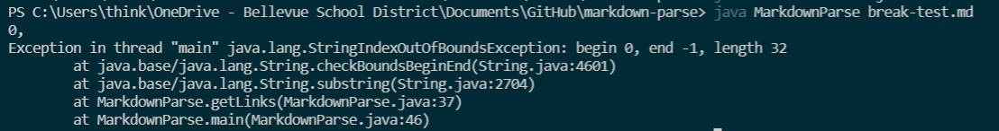
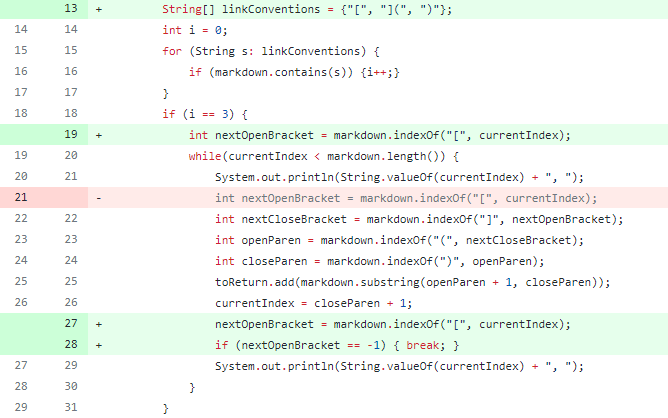
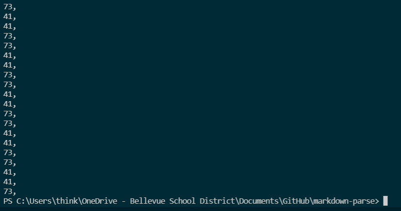
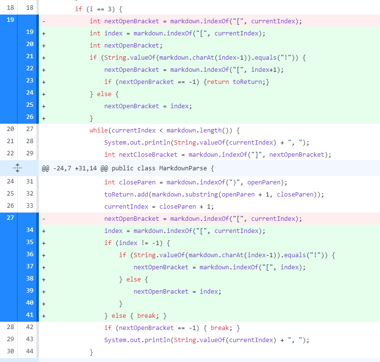
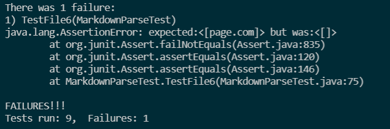

# Lab Report 2- Debugging
*JANUARY 28, 2022*

## CODE CHANGE #1:
---

The failure-inducing input that prompted the change: [Test File](break-test.md)

Symptom of the failure-inducing input: 

---
*The failure-inducing input for this error was a markdown file with only square brackets and unfinished parentheses (which means we should expect no links to be printed). The symptom after running this failure-inducing input is the error that there is an index out of bounds. The bug in the code was that it did not check to make sure that there were all square and round brackets before entering the loop. Therefore, when it looked for the index of the ")", it did not exist and therefore returned -1, leading to our symptom of the IndexOutOfBounds exception.*

---

## CODE CHANGE #2:
---

The failure-inducing input that prompted the change: [Test File](test-file2.md)

Symptom of the failure-inducing input: 

---
*For this error, the failure-inducing input was a markdown file that included additional text after the final link. This led to the symptom of an infinite loop, because of the bug in the code: the code was assuming that once the current index incremented by 1 after the final parentheses, it would become longer than the length of the text, therefore ending the while loop. This would only work if the parentheses is the last character in the markdown file.*

---

## CODE CHANGE #3:
---

The failure-inducing input that prompted the change: [Test File](test-file6.md)

Symptom of the failure-inducing input: 

---
*The failure-inducing input in this case was an image (an exclamation point before the first open square bracket). Because of the bug in the code, in which it did not check for the "!" before the brackets, the code printed the image link when we did not want it to (the wrong output was our symptom).*

---