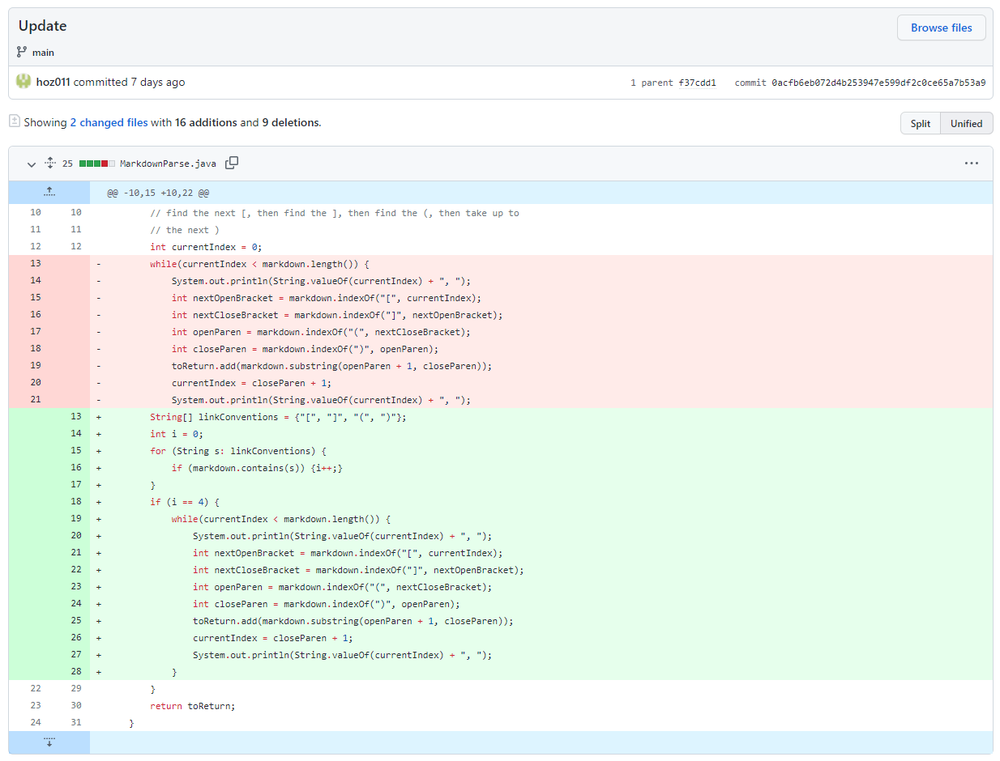

# Lab Report 2- Debugging
*JANUARY 28, 2022*

## CODE CHANGE #1:
---

The failure inducing input that prompted the change: [Test File](break-test.md)

Symptom of the failure-inducing input: 

The failure-inducing input for this error was a markdown file with only square brackets and no parentheses (which means we should expect no links to be printed). The symptom after running this failure-inducing input is the error that there is an index out of bounds. The bug in the code was that it did not check to make sure that there were both square and round brackets before entering the loop. Therefore, when it looked for the index of the "(" and ")", they did not exist and therefore returned -1, leading to our symptom of the IndexOutOfBounds exception.