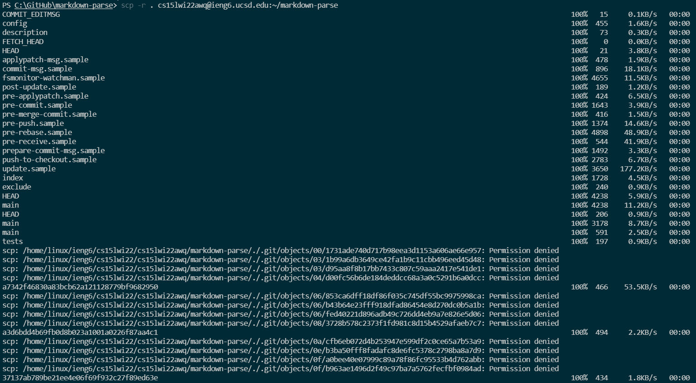
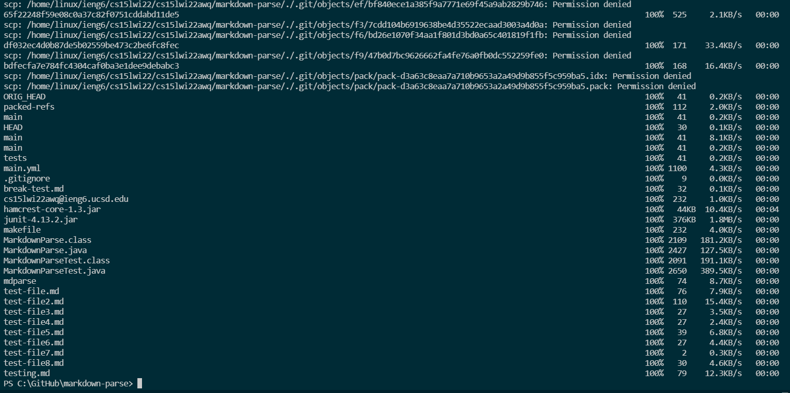
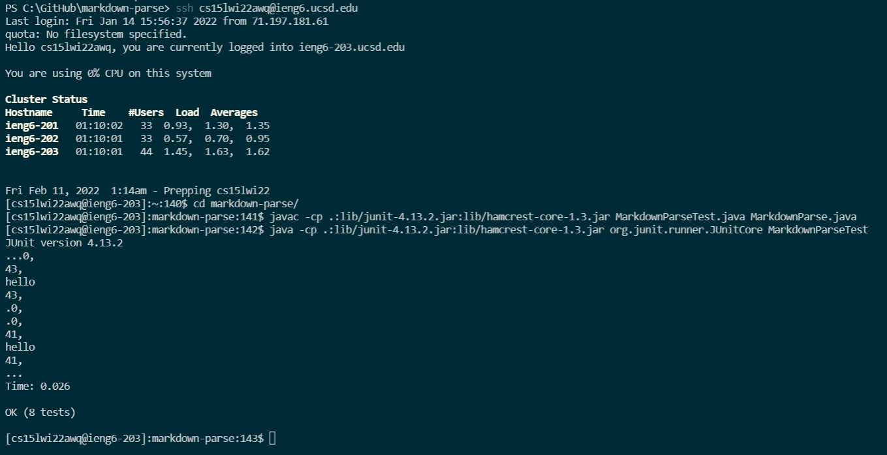

# Lab Report 3- Copying Directories
*FEBRUARY 11, 2022*

The `scp -r` command allows us to copy over all the files in a directory recursively, making it much easier and faster for us to copy files in directories.

## Copying the markdown-parse directory

Using the command 

`scp -r . cs15lwi22__@ieng6.ucsd.edu:~/markdown-parse`

As the entire terminal output could not fit in one screen, I split it into 2. It lists all the files in the directory as it copies it over.

## Logging into ssh and running the test file

I first `ssh` into my account. then, I run the same `javac` and `java` commands once I `cd` into the correct directory. It runs all the tests.

## Running Commands from One Line

