# Lab Report 4- Debugging
*FEBRUARY 25, 2022*

## SNIPPET #1:
---

**WHAT IT SHOULD PRODUCE:**

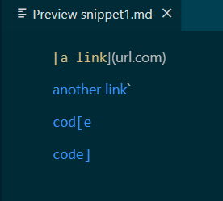

**THE TEST:**

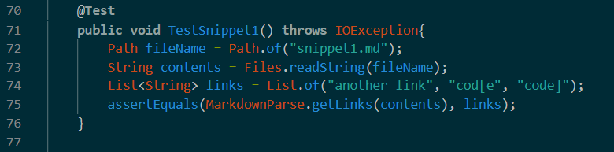

**TEST RESULT FOR MY IMPLEMENTATION:**

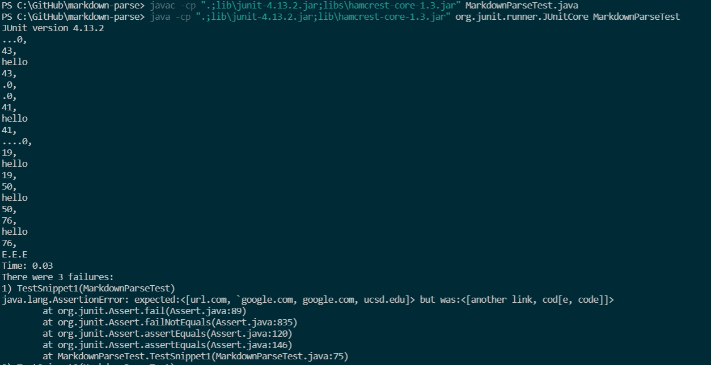

**TEST RESULT FOR THE IMPLEMENTATION I REVIEWED:**

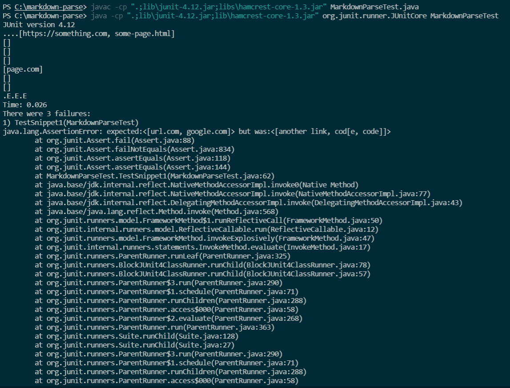

**FIXING THE CODE:**

A possible way that we can fix the code to work for all test cases involving backticks is to provide a check for backticks in the code and rewrite the code to be the same but with no backticks. Perhaps using `split()` or a similar method.

## SNIPPET #2:
---

**WHAT IT SHOULD PRODUCE:**

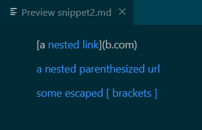

where the blue words are the links.

**THE TEST:**

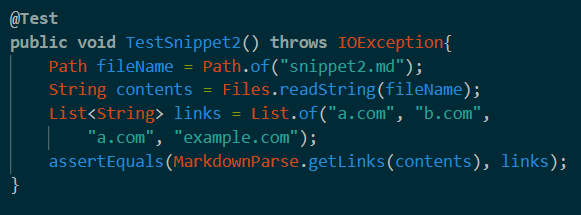

**TEST RESULT FOR MY IMPLEMENTATION:**

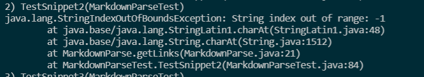

**TEST RESULT FOR THE IMPLEMENTATION I REVIEWED:**

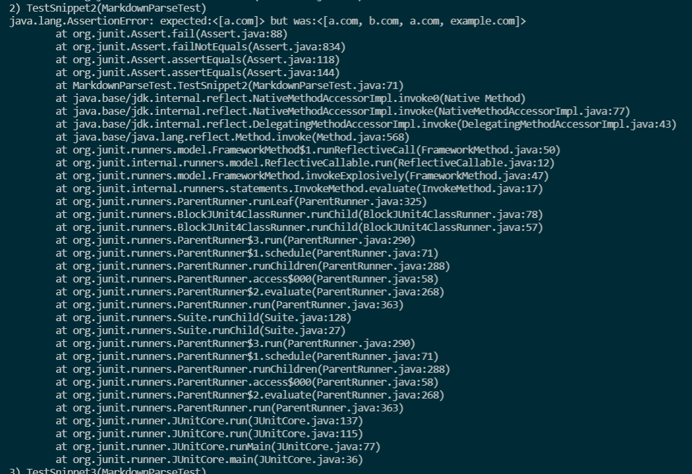

**FIXING THE CODE:**

This code doesn't work because there are multiple brackets inside of each other. We can fix this by pairing each open and close bracket with some kind of indicator, perhaps a stack or a counter. For instance, the current close bracket pairs with the most recent open bracket, not the open bracket before it.

## SNIPPET #3:
---

**WHAT IT SHOULD PRODUCE:**

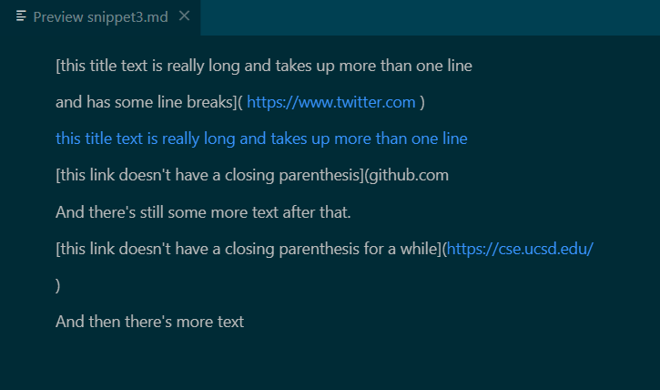

**THE TEST:**

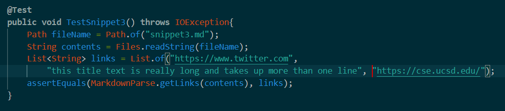

**TEST RESULT FOR MY IMPLEMENTATION:**

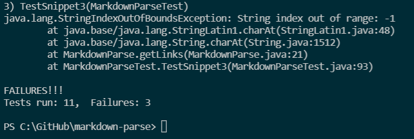

**TEST RESULT FOR THE IMPLEMENTATION I REVIEWED:**

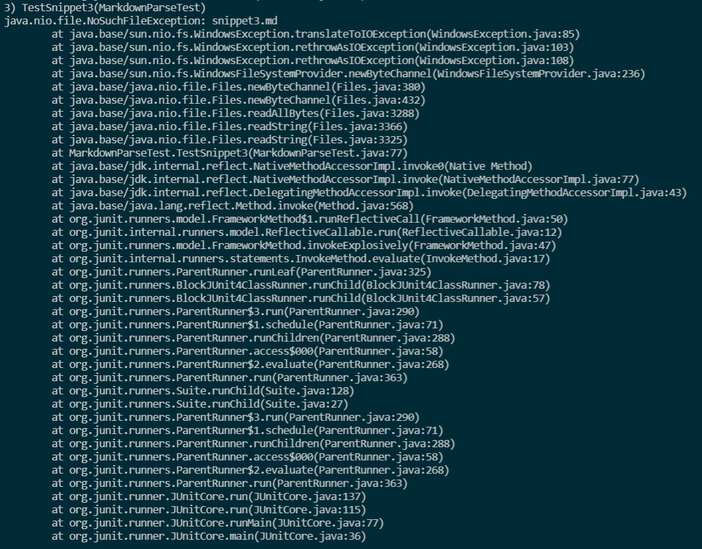

**FIXING THE CODE:**

For this one, 