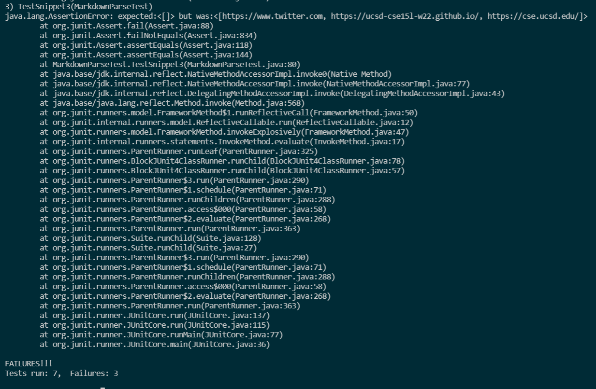

# Lab Report 4- Debugging
*FEBRUARY 25, 2022*

## SNIPPET #1:
---

**WHAT IT SHOULD PRODUCE:**

**THE TEST:**

**TEST RESULT FOR MY IMPLEMENTATION:**

**TEST RESULT FOR THE IMPLEMENTATION I REVIEWED:**

**FIXING THE CODE:**

## SNIPPET #2:
---

**WHAT IT SHOULD PRODUCE:**

where the blue words are the links.

**THE TEST:**

**TEST RESULT FOR MY IMPLEMENTATION:**

**TEST RESULT FOR THE IMPLEMENTATION I REVIEWED:**

**FIXING THE CODE:**

## SNIPPET #3:
---

**WHAT IT SHOULD PRODUCE:**

**THE TEST:**

**TEST RESULT FOR MY IMPLEMENTATION:**

**TEST RESULT FOR THE IMPLEMENTATION I REVIEWED:**

**FIXING THE CODE:**