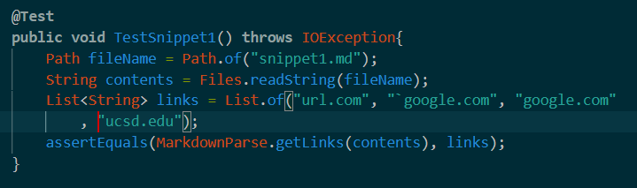
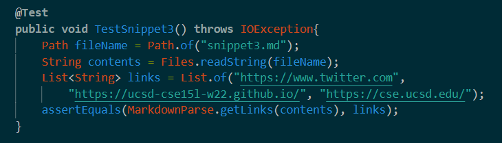

# Lab Report 4- Debugging
*FEBRUARY 25, 2022*

[My implementation](https://github.com/hoz011/markdown-parse)

[Reviewed implementation](https://github.com/tanpatil/markdown-parse)

## SNIPPET #1:
---

**WHAT IT SHOULD PRODUCE:**

where the blue letters represent the links.

**THE TEST:**

the JUnit test for snippet 1.

**TEST RESULT FOR MY IMPLEMENTATION:**

**TEST RESULT FOR THE IMPLEMENTATION I REVIEWED:**

**FIXING THE CODE:**

A possible way that we can fix the code to work for all test cases involving backticks is to provide a check for backticks in the code and rewrite the code to be the same but with no backticks. Perhaps using `split()` or a similar method.

## SNIPPET #2:
---

**WHAT IT SHOULD PRODUCE:**

where the blue words are the links.

**THE TEST:**

**TEST RESULT FOR MY IMPLEMENTATION:**

**TEST RESULT FOR THE IMPLEMENTATION I REVIEWED:**

**FIXING THE CODE:**

This code doesn't work because there are multiple brackets inside of each other. We can fix this by pairing each open and close bracket with some kind of indicator, perhaps a stack or a counter. For instance, the current close bracket pairs with the most recent open bracket, not the open bracket before it.

## SNIPPET #3:
---

**WHAT IT SHOULD PRODUCE:**

**THE TEST:**

**TEST RESULT FOR MY IMPLEMENTATION:**

The test passes for my implementation.

**TEST RESULT FOR THE IMPLEMENTATION I REVIEWED:**

**FIXING THE CODE:**

For this one, what is messing it up is the amount of line breaks inside the brackets and parenthesis. We can use the `replace()` methods, using `/n` to represent line breaks, and replace the line breaks inside the parenthesis/brackets with spaces. Then, the normal code could work as per usual.